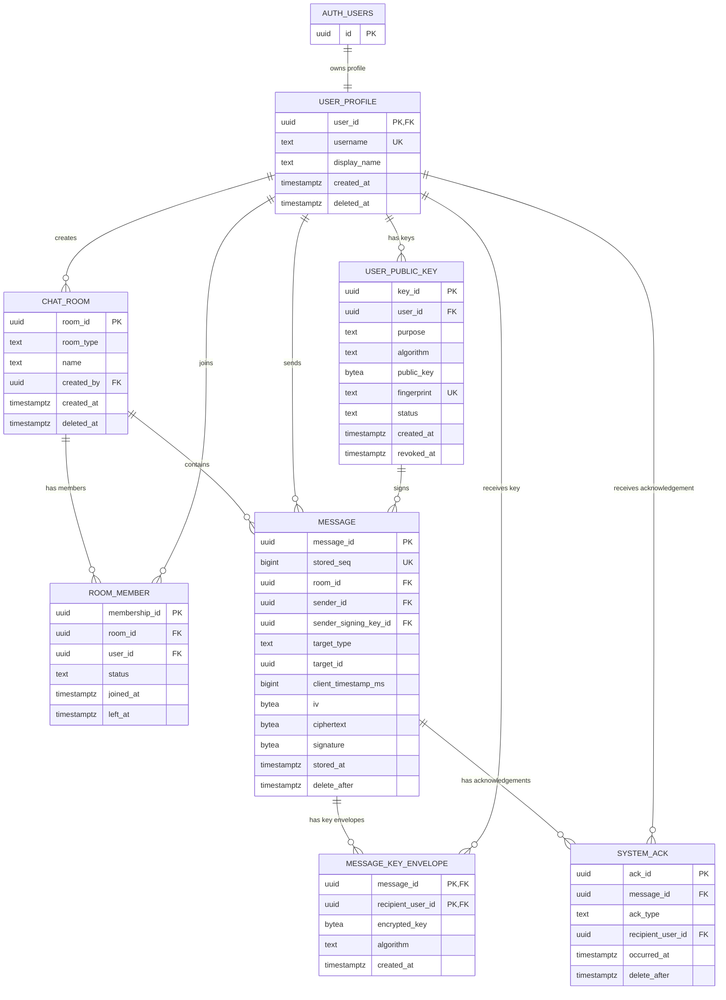

# Database Model

This model shows the relational structure currently implemented in Supabase.

Notes:

- Supabase Auth stores identities in `auth.users`.
- Message content and per-recipient keys are stored separately.
- There is no central room key.
- `system_ack` contains only server and delivery acknowledgements; there is no read acknowledgement.
- Messages and acknowledgements have a default retention period of 30 days.
- RLS policies are documented in [`../supabase/rls_policies.sql`](../supabase/rls_policies.sql).
