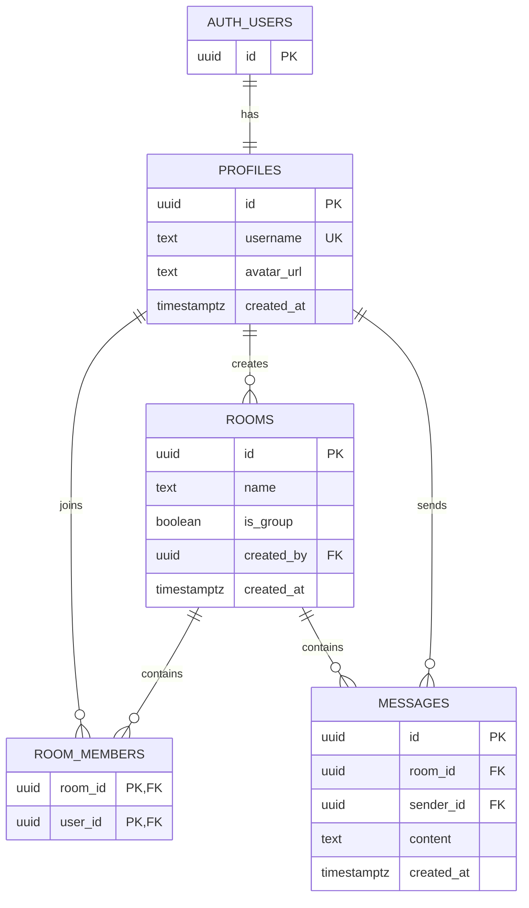

# Simplified Database Model

This document describes the current Supabase database for the chat proof of concept. It uses Supabase Auth, four application tables and readable text messages.

The SQL files are a reference for the implemented structure. They are not connected to an automatic production migration.

## Overview



## Supabase Auth

Supabase automatically manages the private `auth.users` table. It stores login information such as email addresses and password hashes. Application code should not store passwords in the public schema.

After a new user signs up, the `create_profile_after_signup` trigger creates a matching row in `profiles`. Both rows use the same UUID.

## Tables

### `profiles`

Stores the public information shown in the chat application.

| Column | Purpose |
| --- | --- |
| `id` | User ID from `auth.users` and primary key |
| `username` | Unique public name |
| `avatar_url` | Optional public URL of the profile picture |
| `created_at` | Time when the profile was created |

### `rooms`

Stores private chats and group chats.

| Column | Purpose |
| --- | --- |
| `id` | Unique room ID |
| `name` | Display name of the room |
| `is_group` | `true` for a group and `false` for a private chat |
| `created_by` | Profile that created the room |
| `created_at` | Time when the room was created |

### `room_members`

Connects users with rooms. The combined primary key of `room_id` and `user_id` prevents duplicate memberships.

| Column | Purpose |
| --- | --- |
| `room_id` | Room that the user belongs to |
| `user_id` | Profile that belongs to the room |

### `messages`

Stores readable chat messages.

| Column | Purpose |
| --- | --- |
| `id` | Unique message ID supplied by the application |
| `room_id` | Room containing the message |
| `sender_id` | Profile that sent the message |
| `content` | Message text |
| `created_at` | Time when Supabase stored the message |

`content` is stored as plain text. This simple proof of concept does not provide end-to-end encryption, so database administrators and privileged backend services can read messages.

## Profile pictures

Profile picture files are stored in the public Supabase Storage bucket `avatars`. The database stores only the public file URL in `profiles.avatar_url`.

Each user has a separate folder:

```text
avatars/<user-id>/profile.png
```

Images can be displayed directly from `avatar_url`. Public users may read avatar files, while signed-in users may upload, replace or delete files only inside their own user folder.

## Row Level Security

All four public tables use Row Level Security (RLS):

- signed-in users may read all profiles, but update only their own profile;
- only a room creator or member may read a room;
- only the room creator may add members;
- the creator may remove members, and a member may leave the room;
- only room members may read messages;
- a room member may send a message only with their own user ID;
- messages cannot be updated or deleted through the public client API.

The helper functions `is_room_member` and `is_room_creator` perform internal membership checks without recursive RLS queries.

## Application flow

1. A user registers through Supabase Auth.
2. The signup trigger creates the public profile.
3. A signed-in user creates a room and adds members.
4. Room members insert messages into `messages.content`.
5. Room members read messages for their rooms.
6. The frontend joins `messages.sender_id` with `profiles.id` to show the sender name and avatar.
